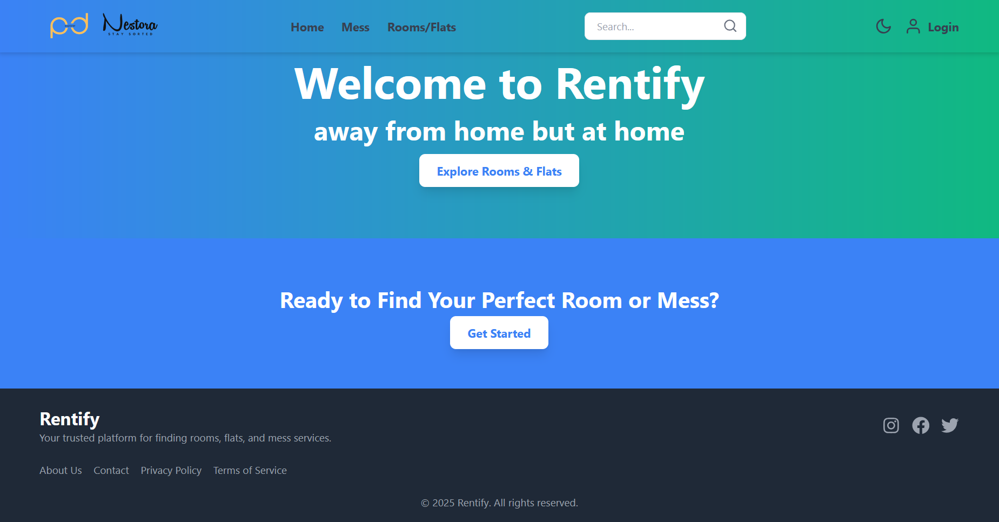
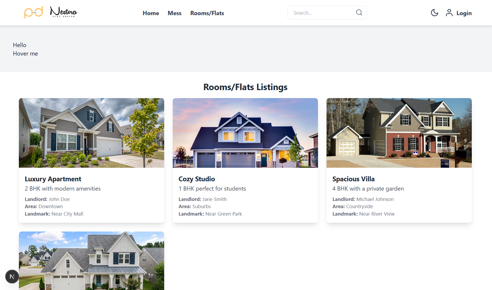
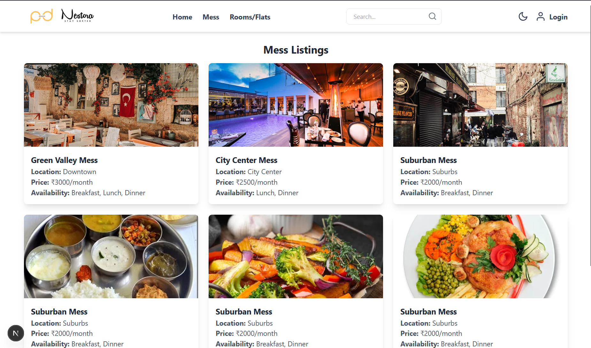
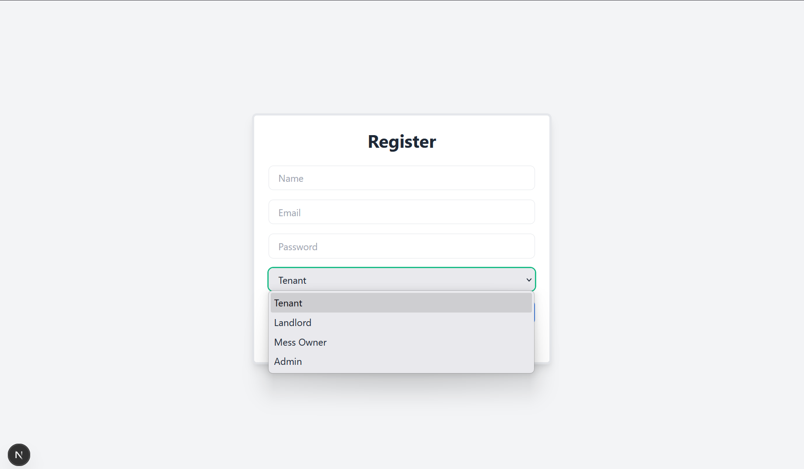

# 🏠 Nestora – Rental Rooms, Flats & Mess Management System

**Nestora** is a modern web-based platform built to help students, tenants, and landlords seamlessly connect for rental accommodations and mess services. The system is especially beneficial for individuals relocating to new cities or college towns.

---

## 🧩 Project Overview

Nestora simplifies rental and mess management through an integrated portal offering:

- 🎯 Centralized listings for rooms, flats, and mess services.
- 🧑‍💼 Role-based access for tenants, landlords, and mess owners.
- 🧾 User authentication and secure access using Firebase.
- 📲 Responsive design tailored for mobile-first experiences.

---

## 💡 Key Features

- 🏘️ Post and manage room/flat/mess listings
- 📥 Book rooms or mess services directly through the app
- 🧑‍💼 Interactive dashboard per user role (tenant, landlord, mess owner)
- 🛡️ Firebase authentication for secure login
- 🎨 Modern UI built with React and Tailwind CSS
- 📱 Responsive layout suitable for mobile and desktop
- 🌓 Light and dark theme toggle (planned)

---

## 📸 Screenshots

### 🏠 Home Page


### 🛏️ Rooms Listing Page


### 🍱 Mess Listing Page


### 📝 Registration Page


> Ensure all image files are inside `app/nestora/nestoraImg/`  
> and paths are correctly written relative to the README file.

---

## ⚙️ Tech Stack

| Layer         | Technologies                                      |
|---------------|---------------------------------------------------|
| Frontend      | React.js, Tailwind CSS, Bootstrap                 |
| Backend       | Flask (Python) for ML modules, Node.js (future)   |
| Database      | Firebase Firestore (current), MongoDB (future)   |
| Auth          | Firebase Authentication                           |
| UI/UX Design  | Figma (for wireframes & design)                   |
| NLP & ML (planned) | Transformers, NLTK, scikit-learn             |

---

## 🏗️ Folder Structure

```bash
app/
└── nestora/
    ├── nestoraImg/
    │   ├── home.png
    │   ├── rooms.png
    │   ├── mess.png
    │   └── registerPage.png
    ├── pages/
    ├── components/
    └── README.md
